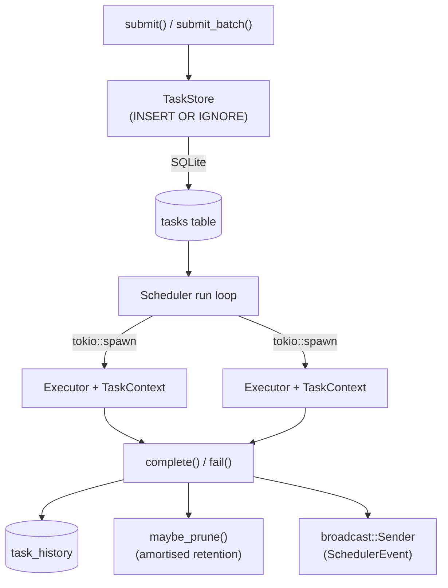
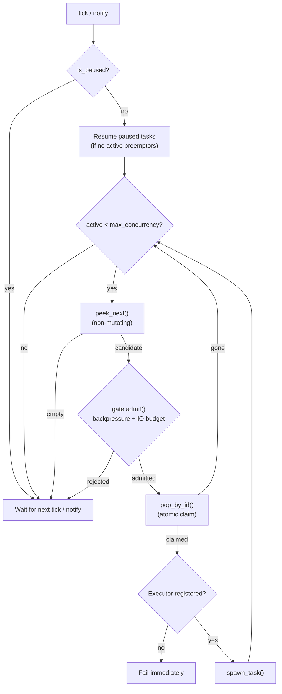

# Taskmill Architecture

Taskmill is an adaptive priority work scheduler with IO-aware concurrency and
SQLite persistence, designed for desktop apps (Tauri) and background services.

## Module map

```
taskmill/
  src/
    lib.rs                 — public API re-exports
    task.rs                — TaskRecord, TaskSubmission, TaskResult, TaskError, TypedTask, etc.
    priority.rs            — Priority newtype (u8, lower = higher priority)
    store.rs               — TaskStore: SQLite persistence, atomic pop, queries, retention
    registry.rs            — TaskExecutor trait (RPITIT), TaskContext, TaskTypeRegistry
    backpressure.rs        — PressureSource trait, ThrottlePolicy, CompositePressure
    scheduler/
      mod.rs               — Scheduler, SchedulerBuilder, run loop, events, snapshot
      gate.rs              — DispatchGate trait, DefaultDispatchGate, IO budget check
      dispatch.rs          — ActiveTaskMap, spawn_task(), preemption
      progress.rs          — ProgressReporter, EstimatedProgress, throughput extrapolation
    resource/
      mod.rs               — ResourceSampler + ResourceReader traits, ResourceSnapshot
      sampler.rs           — EWMA-smoothed background loop, SmoothedReader
      sysinfo_monitor.rs   — SysinfoSampler via `sysinfo` crate (feature-gated)
  migrations/
    001_tasks.sql          — tasks table, task_history table, indexes
```

## Task lifecycle

```
Submit ──► Pending ──► Running ──► Completed  (moved to task_history)
                │         │
                │         ├──► Failed         (moved to task_history, or retried)
                │         │
                │         └──► Paused         (preempted by higher-priority work)
                │                 │
                └─────────────────┘            (resumed when preemptors finish)
```

Active-queue states (`tasks` table): `pending`, `running`, `paused`.
Terminal states (`task_history` table): `completed`, `failed`.

## Data flow



## SQLite schema

### `tasks` — active queue

| Column                | Purpose                                            |
|-----------------------|----------------------------------------------------|
| `id`                  | `INTEGER PRIMARY KEY` — insertion order within tier|
| `task_type`           | Executor lookup name (e.g. `"scan-l3"`)            |
| `key`                 | `UNIQUE` — SHA-256 deduplication key               |
| `priority`            | `INTEGER NOT NULL` — 0 (highest) to 255 (lowest)  |
| `status`              | `TEXT` — `pending`, `running`, or `paused`         |
| `payload`             | `BLOB` — opaque, max 1 MiB, executor-defined       |
| `expected_read_bytes` | Caller's IO estimate for scheduling decisions      |
| `expected_write_bytes`| Caller's IO estimate for scheduling decisions      |
| `retry_count`         | Incremented on each retryable failure              |
| `last_error`          | Most recent error message (for diagnostics)        |
| `started_at`          | Set when popped; cleared on pause                  |

A partial index `idx_tasks_pending` on `(status, priority ASC, id ASC) WHERE
status = 'pending'` covers the scheduler's hot path (`pop_next`), making
priority-ordered pops efficient regardless of how many running or paused tasks
sit in the table.

### `task_history` — terminal records

Completed and failed tasks are moved here atomically (delete from `tasks`,
insert into `task_history` in one transaction). Additional columns:

| Column                | Purpose                                            |
|-----------------------|----------------------------------------------------|
| `actual_read_bytes`   | Reported by executor on completion                 |
| `actual_write_bytes`  | Reported by executor on completion                 |
| `completed_at`        | Timestamp of completion or failure                 |
| `duration_ms`         | Computed from `started_at` to `completed_at`       |

An index `idx_history_type_completed` on `(task_type, completed_at DESC)`
supports IO learning queries (`avg_throughput`, `history_stats`).

### Connection pool

Defaults to 16 connections (`StoreConfig::max_connections`). SQLite serialises
writes regardless, so this primarily benefits concurrent reads from multiple
Tauri commands and background tasks.

### Retention policy

`StoreConfig::retention_policy` controls automatic pruning of `task_history`:

- `RetentionPolicy::MaxCount(n)` — keep at most N history records
- `RetentionPolicy::MaxAgeDays(n)` — keep records from the last N days

Pruning is amortised: an `AtomicU64` completion counter triggers `maybe_prune()`
every `prune_interval` completions (default 100) rather than after every single
completion. Pruning errors are logged but never propagated — the task itself is
already committed. Manual pruning is available via `prune_history_by_count()` and
`prune_history_by_age()`.

## Deduplication

Key generation: `SHA-256(task_type + ":" + (explicit_key OR payload))`. The task
type is always incorporated so different types with identical payloads never
collide.

Enforcement uses the `UNIQUE(key)` constraint with `INSERT OR IGNORE` — a
duplicate submission silently returns `None`. The key stays occupied while the
task is active (including retries) and is freed when the task moves to history.

## Priority queue

The priority queue lives entirely in SQLite. `pop_next()` is an atomic
`UPDATE ... RETURNING` that claims the highest-priority pending row:

```sql
UPDATE tasks SET status = 'running', started_at = datetime('now')
WHERE id = (
    SELECT id FROM tasks WHERE status = 'pending'
    ORDER BY priority ASC, id ASC LIMIT 1
)
RETURNING *
```

`priority ASC` means lower numeric values are popped first (higher priority).
`id ASC` breaks ties by insertion order (FIFO within a tier). The partial index
makes this a single index scan.

The `Priority` type is a `u8` newtype with named constants:

| Constant     | Value | Behaviour                             |
|--------------|-------|---------------------------------------|
| `REALTIME`   | 0     | Never throttled, triggers preemption  |
| `HIGH`       | 64    | Throttled only under extreme pressure |
| `NORMAL`     | 128   | Standard background work              |
| `BACKGROUND` | 192   | Paused under moderate pressure        |
| `IDLE`       | 255   | Runs only when system is idle         |

`Ord` is reversed so `REALTIME > IDLE` semantically. Custom tiers are available
via `Priority::new(n)`.

## Scheduler architecture

The scheduler is split across four files:

| File           | Concern                                                       |
|----------------|---------------------------------------------------------------|
| `mod.rs`       | Orchestration: run loop, submit, cancel, snapshot, builder    |
| `gate.rs`      | Admission control: backpressure + IO budget                   |
| `dispatch.rs`  | Task lifecycle: active map, spawn, preemption                 |
| `progress.rs`  | Progress reporting + throughput-based extrapolation            |

### Dispatch cycle



The run loop wakes on two signals:

1. **`Notify`** — triggered by `submit()`, `submit_batch()`, and `resume_all()`,
   so newly enqueued work is picked up without waiting for the next tick.
2. **`poll_interval` timer** (default 500 ms) — fallback for paused-task
   resumption and periodic housekeeping.

Key design: the loop uses **peek-then-pop-by-id** rather than a bare `pop_next()`.
The gate inspects the candidate without mutating the queue; only after admission
does `pop_by_id()` atomically claim it. If another consumer claimed it in the
meantime, the loop simply retries. This eliminates the earlier race where a
popped-then-rejected task needed an explicit requeue step.

Each stage independently halts dispatch:

- **Concurrency** — hard cap via `max_concurrency` (`AtomicUsize`, adjustable at runtime)
- **DispatchGate** — pluggable admission (default: backpressure + IO budget)
- **Empty queue** — no pending tasks

### Clone-friendly design

`Scheduler` wraps all shared state in `Arc<SchedulerInner>` and derives `Clone`:

- Holds directly in `tauri::State<Scheduler>` without extra `Arc` wrapping
- Cheap clones that share the underlying store, registry, and active map

### Builder

```rust
Scheduler::builder()
    .store_path("tasks.db")
    .executor("scan", Arc::new(ScanExecutor))
    .executor("exif", Arc::new(ExifExecutor))
    .pressure_source(Box::new(battery_pressure))
    .max_concurrency(8)
    .shutdown_mode(ShutdownMode::Graceful(Duration::from_secs(30)))
    .with_resource_monitoring()
    .app_state(MyServices { http, db, cache })
    .build()
    .await?;
```

The builder handles: opening the store, assembling the registry, composing
pressure sources, spawning the resource sampler, and wiring the `SmoothedReader`.
The lower-level `Scheduler::new()` remains for advanced use.

## Dispatch gate (internal)

The `DispatchGate` trait (`pub(crate)`) controls admission. The default
`DefaultDispatchGate` applies two checks:

1. **Backpressure** — `ThrottlePolicy::should_throttle(priority, pressure)`.
2. **IO budget** — `has_io_headroom()`, described below.

The trait also exposes `pressure()` and `pressure_breakdown()` (with default
no-op impls) so `Scheduler::snapshot()` can read backpressure state without
knowing the concrete gate type.

## IO-aware scheduling

### Expected vs actual IO

Callers provide `expected_read_bytes` / `expected_write_bytes` on submission.
Executors report `actual_read_bytes` / `actual_write_bytes` on completion. The
history table stores both, enabling learning via `avg_throughput()` and
`history_stats()`.

### IO budget heuristic

When a `ResourceReader` is present, `has_io_headroom()` runs before each
dispatch:

1. Read the latest EWMA-smoothed `ResourceSnapshot` (disk bytes/sec).
2. Sum expected IO across all currently running tasks.
3. Compute a 2-second budget window: `capacity = bytes_per_sec * 2.0`.
4. Defer if running IO exceeds 80% of capacity on either read or write axis.

If no reader is configured the check is skipped (always allows dispatch).

### Resource monitoring

Two traits split sampling from consumption:

- **`ResourceSampler`** — `sample() -> ResourceSnapshot`. Raw platform readings.
- **`ResourceReader`** — `latest() -> ResourceSnapshot`. Read-only, sync.

`SmoothedReader` bridges them: the `run_sampler()` background loop calls
`sampler.sample()` at a configurable interval (default 1 s), applies EWMA
smoothing (alpha 0.3), and writes to the `SmoothedReader`. The scheduler reads
via `reader.latest()`, which uses `RwLock` so readers never block each other.

The built-in `SysinfoSampler` (behind the `sysinfo-monitor` feature) provides
cross-platform CPU and disk IO via the `sysinfo` crate.

## Backpressure

### PressureSource trait

```rust
pub trait PressureSource: Send + Sync + 'static {
    fn pressure(&self) -> f32;  // 0.0 (idle) to 1.0 (saturated)
    fn name(&self) -> &str;
}
```

Implement for external signals: API rate, memory, queue depth, battery, etc.

### CompositePressure

Aggregates multiple sources. The composite value is the **max** across all — the
system is as pressured as its most constrained resource. `breakdown()` provides
per-source diagnostics.

### ThrottlePolicy

Default three-tier policy:

| Priority range    | Throttle threshold |
|-------------------|--------------------|
| BACKGROUND (192+) | > 50% pressure    |
| NORMAL (128+)     | > 75% pressure    |
| HIGH / REALTIME   | Never throttled   |

Custom policies via `ThrottlePolicy::new(thresholds)`.

## Preemption

When a task is submitted at or above `preempt_priority` (default `REALTIME`):

1. All active tasks with strictly lower priority are cancelled
   (`CancellationToken`) and moved to `paused` status in the store.
2. `Preempted` events are emitted.
3. On subsequent poll cycles, paused tasks are only resumed when no active
   preemptors remain — this prevents a thrashing loop of pause/resume/re-preempt.

Executors cooperate by checking `ctx.token.is_cancelled()` at yield points. An
executor that ignores cancellation continues running but is no longer tracked;
its completion or failure is still recorded normally.

## Retry flow

```
Executor returns Err(TaskError)
  └─ retryable: false? ──► move to task_history (failed)
  └─ retryable: true?
       └─ retry_count < max_retries? ──► status → pending, retry_count += 1
       └─ otherwise ──► move to task_history (failed)
```

- Retried tasks keep their original priority (no demotion).
- The dedup key remains occupied during retries.
- `max_retries` defaults to 3 (`SchedulerConfig`).

## Event system

`Scheduler::subscribe()` returns a `tokio::sync::broadcast::Receiver<SchedulerEvent>`:

| Event       | When                                         |
|-------------|----------------------------------------------|
| `Dispatched`| Task popped and executor spawned             |
| `Completed` | Task finished successfully                   |
| `Failed`    | Task failed (includes `will_retry` flag)     |
| `Preempted` | Task paused for higher-priority work         |
| `Cancelled` | Task cancelled via `cancel()`                |
| `Progress`  | Executor reported progress (0.0–1.0)         |
| `Paused`    | Scheduler globally paused                    |
| `Resumed`   | Scheduler globally resumed                   |

All variants derive `Serialize`/`Deserialize`.

## Progress reporting

### Executor-reported

Executors call `ctx.progress.report(percent, message)` or
`ctx.progress.report_fraction(completed, total, message)`. These emit
`SchedulerEvent::Progress` and update the active task map.

### Throughput-extrapolated

For tasks that don't report progress, `estimated_progress()` extrapolates from
elapsed time vs. the historical average duration for that task type. When a
partial report exists, the extrapolation blends historical and current throughput
for a more accurate estimate.

`EstimatedProgress` provides `reported_percent`, `extrapolated_percent`, and a
unified `percent` (reported preferred over extrapolated).

## Task type registry

`TaskTypeRegistry` maps string names to executor implementations. The public
`TaskExecutor` trait uses RPITIT (`impl Future`) for ergonomic async; an internal
`ErasedExecutor` trait provides object-safe dynamic dispatch for storage.

Duplicate registration panics — catches configuration errors at startup. When the
scheduler pops a task with no registered executor, it fails immediately with a
descriptive error.

The registry is essential for crash recovery: after `recover_running()` resets
in-flight tasks to pending, the scheduler needs the registry to re-dispatch them.

## Application state

Executors often need shared services. Rather than capturing `Arc<T>` per executor,
the scheduler provides a type-keyed `StateMap` that supports multiple state types:

```rust
Scheduler::builder()
    .app_state(MyServices { http, db, cache })
    .app_state(FeatureFlags { dark_mode: true })
    .build().await?;

// In the executor:
let svc = ctx.state::<MyServices>().expect("state not set");
let flags = ctx.state::<FeatureFlags>().expect("flags not set");
```

State flows: `SchedulerBuilder` collects `(TypeId, Arc<dyn Any>)` entries →
assembled into `Arc<StateMap>` at build time → a `StateSnapshot` (lock-free
`HashMap` clone) is taken once per dispatch and placed in `TaskContext` →
executors call `ctx.state::<T>()` which does a `TypeId` lookup + downcast.

Libraries that embed a shared scheduler can inject their own state **after**
build via `scheduler.register_state(Arc::new(LibState { .. })).await`. This
is how shoebox injects `ScanAppState` into an externally-provided scheduler.

This mirrors Axum's `State<T>` / Tauri's `State<T>` pattern.

## Global pause / resume

`pause_all()` sets an `AtomicBool` flag, cancels every running task's token,
moves them to paused status, and emits `Paused`. While paused the run loop skips
dispatch entirely.

`resume_all()` clears the flag, wakes the run loop via `Notify`, and emits
`Resumed`. Paused tasks are picked up by the existing resumption logic on the
next cycle.

`try_dispatch()` does **not** check the flag, so manual single-task dispatch
still works while globally paused. `SchedulerSnapshot::is_paused` reflects the
flag for UI integration.

## Graceful shutdown

`ShutdownMode` controls behaviour when the run loop's `CancellationToken` fires:

- **`Hard`** (default) — cancel all running tasks immediately.
- **`Graceful(Duration)`** — stop dispatching, wait for running tasks to finish
  (up to the timeout), then cancel stragglers.

Both modes cancel the resource sampler's `CancellationToken`.

## Crash recovery

On `TaskStore::open()`, the store runs:

```sql
UPDATE tasks SET status = 'pending', started_at = NULL WHERE status = 'running'
```

Any task mid-execution when the process died is reset to pending. This is safe
because executors should be idempotent (or check for partial work), the dedup key
stays occupied (no duplicates), and `retry_count` is preserved.

## Thread safety

- `Scheduler` — `Clone` via `Arc<SchedulerInner>`
- `TaskStore` — `Clone` via `SqlitePool`; WAL journal mode for concurrent access
- `max_concurrency` — `AtomicUsize`, lock-free runtime adjustment
- `paused` — `AtomicBool` with `Release`/`Acquire` ordering
- `ActiveTaskMap` — `Arc<Mutex<HashMap>>`, `Clone`
- `SmoothedReader` — `RwLock` so readers never block each other
- `TaskTypeRegistry` — immutable after startup, shared via `Arc`
- Application state — `Arc<dyn Any + Send + Sync>`, shared across all tasks
- Each spawned task gets its own `CancellationToken`
- All trait objects require `Send + Sync + 'static`

## Feature flags

- **`sysinfo-monitor`** (default) — enables `SysinfoSampler` for cross-platform
  CPU and disk IO. Disable for mobile targets or when providing a custom sampler.

Serde (`Serialize`/`Deserialize`) is always enabled on all public types.

## Configuration reference

### SchedulerConfig

| Field                    | Default       | Notes                              |
|--------------------------|---------------|------------------------------------|
| `max_concurrency`        | 4             | Adjustable at runtime              |
| `max_retries`            | 3             |                                    |
| `preempt_priority`       | `REALTIME`    |                                    |
| `poll_interval`          | 500 ms        | Fallback; notify wakes sooner      |
| `throughput_sample_size` | 20            | History rows for IO learning       |
| `shutdown_mode`          | `Hard`        |                                    |

### StoreConfig

| Field              | Default | Notes                                     |
|--------------------|---------|-------------------------------------------|
| `max_connections`  | 16      | SQLite pool size                          |
| `retention_policy` | `None`  | `MaxCount(n)` or `MaxAgeDays(n)`          |
| `prune_interval`   | 100     | Prune every N completions                 |

### SamplerConfig

| Field        | Default | Notes                    |
|--------------|---------|--------------------------|
| `interval`   | 1 s     | Sample period            |
| `ewma_alpha` | 0.3     | Smoothing factor (0–1)   |

## Tauri integration

### State management

```rust
app.manage(scheduler);  // Scheduler is Clone — no Arc needed

#[tauri::command]
async fn submit_task(
    scheduler: tauri::State<'_, Scheduler>,
) -> Result<Option<i64>, StoreError> {
    scheduler.submit(&submission).await
}

#[tauri::command]
async fn scheduler_status(
    scheduler: tauri::State<'_, Scheduler>,
) -> Result<SchedulerSnapshot, StoreError> {
    scheduler.snapshot().await
}
```

### Event bridging

```rust
let mut events = scheduler.subscribe();
let handle = app_handle.clone();
tokio::spawn(async move {
    while let Ok(event) = events.recv().await {
        handle.emit("taskmill-event", &event).unwrap();
    }
});
```

### Error handling

`StoreError` derives `Serialize`/`Deserialize`, so it can be returned directly
from Tauri commands without conversion.

### Cross-platform

Gate `sysinfo-monitor` for mobile: `default-features = false`. Provide a custom
`ResourceSampler` for iOS/Android if needed. Everything else (SQLite, scheduling,
events) works on all platforms.
