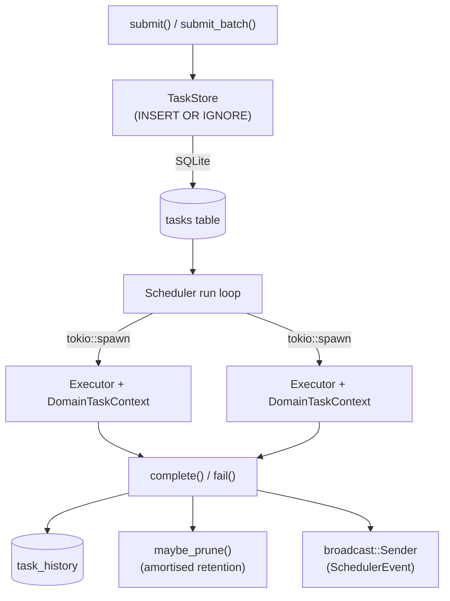
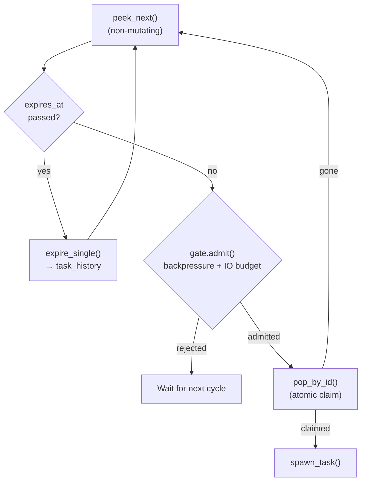

# Design

This document explains *why* taskmill is designed the way it is. If you're looking for *how to use* taskmill, start with the [Quick Start](quick-start.md). This page is for developers who want to understand the architecture to make better integration decisions or extend taskmill.

## Design goals

1. **Crash-safe by default.** Tasks are persisted to SQLite, not held in channels or memory. A killed process loses zero work.
2. **Desktop-friendly.** All public types are `Clone` and `Serialize`. The `Scheduler` fits directly into `tauri::State` with no extra wrapping.
3. **IO-aware.** Most task schedulers ignore throughput. Taskmill's dispatch gate checks disk and network capacity before spawning work, so your app doesn't freeze the system.
4. **Composable.** Pressure sources, resource samplers, throttle policies, and typed state are all pluggable. You can extend without forking.

## Architecture overview

### Module map

```
taskmill/src/
  lib.rs                 — public API re-exports
  domain.rs              — Domain<D>, DomainKey, DomainHandle<D>, TypedExecutor<T>,
                           TaskTypeConfig, DomainSubmitBuilder, TypedEventStream
  task/                  — TaskRecord, TaskSubmission, TaskError, TypedTask
  priority.rs            — Priority newtype (u8, lower = higher priority)
  store/                 — TaskStore: SQLite persistence, atomic pop, queries
  registry/              — TaskExecutor trait, TypedExecutor<T> adapter, TaskContext,
                           TaskTypeRegistry
  backpressure.rs        — PressureSource trait, ThrottlePolicy, CompositePressure
  scheduler/
    mod.rs               — Scheduler, SchedulerBuilder, public API
    run_loop.rs          — main event loop, dispatch cycle
    submit.rs            — submit, submit_batch, cancellation
    control.rs           — pause/resume, concurrency limits
    queries.rs           — snapshot, active tasks, progress
    gate.rs              — DispatchGate, IO budget check
    dispatch.rs          — ActiveTaskMap, spawn_task, preemption
    progress.rs          — ProgressReporter, throughput extrapolation
    event.rs             — SchedulerEvent, SchedulerSnapshot
  resource/
    mod.rs               — ResourceSampler + ResourceReader traits
    sampler.rs           — EWMA-smoothed background loop
    network_pressure.rs  — NetworkPressure source
    sysinfo_monitor.rs   — SysinfoSampler (feature-gated)
```

### Task lifecycle

```
Submit ──► Pending ──► Running ──► Completed  (moved to task_history)
                │         │
                │         ├──► Failed         (moved to task_history, or retried)
                │         │
                │         └──► Paused         (preempted by higher-priority work)
                │                 │
                ├─────────────────┘            (resumed when preemptors finish)
                │
                └──► Expired                  (TTL exceeded → task_history)
```

Active states live in the `tasks` table. Terminal states (`completed`, `failed`, `cancelled`, `superseded`, `expired`) are atomically moved to `task_history`.

### Data flow



## Why SQLite?

- **No external dependencies.** No Redis, no Postgres, no Docker. Just a file on disk.
- **Atomic operations.** `UPDATE ... RETURNING` lets us pop tasks from the queue without race conditions. `INSERT OR IGNORE` handles dedup atomically.
- **WAL for concurrent reads.** Multiple Tauri commands can query task status while the scheduler is dispatching.
- **Portable.** Works on Linux, macOS, Windows, and mobile platforms.

The tradeoff is that SQLite serializes writes, so taskmill isn't suitable for extremely high-throughput scenarios (thousands of submissions per second). For desktop apps and background services, this is never a bottleneck.

## Why peek-then-pop?

The scheduler's dispatch loop uses a two-step approach: first *peek* at the next candidate (non-mutating), then *pop by ID* (atomic claim) only if the dispatch gate admits it.



This eliminates a race from the earlier design: if we popped first and then the gate rejected the task, we'd need to explicitly requeue it — which introduced edge cases around priority ordering and dedup key states. Peek-then-pop keeps the queue state clean.

## How IO gating works

When a `ResourceReader` is present, the scheduler checks IO headroom before dispatching:

1. Read the latest EWMA-smoothed disk throughput (bytes/sec).
2. Sum expected IO across all currently running tasks.
3. Compute a 2-second capacity window: `capacity = throughput * 2.0`.
4. Defer if running IO would exceed 80% of capacity on either read or write axis.

The 2-second window and 80% threshold are conservative defaults. They leave headroom for other applications and OS operations while still allowing taskmill to utilize most of the available throughput.

If no resource reader is configured, the check is skipped — dispatch is purely by priority and concurrency.

## Thread safety model

Taskmill is designed for concurrent access from multiple async tasks and Tauri commands:

| Component | Mechanism | Notes |
|-----------|-----------|-------|
| `Scheduler` | `Clone` via `Arc<SchedulerInner>` | Cheap clones, no extra wrapping needed for Tauri |
| `TaskStore` | `Clone` via `SqlitePool` | WAL mode for concurrent reads |
| `max_concurrency` | `AtomicUsize` | Lock-free runtime adjustment |
| `paused` | `AtomicBool` | Release/Acquire ordering |
| `ActiveTaskMap` | `Arc<Mutex<HashMap>>` | Holds running task metadata |
| `SmoothedReader` | `RwLock` | Readers never block each other |
| `TaskTypeRegistry` | `Arc`, immutable after build | No synchronization needed |
| Application state | `Arc<dyn Any + Send + Sync>` | Shared across all tasks |

Each spawned task gets its own `CancellationToken`. All trait objects require `Send + Sync + 'static`.

### Domain concurrency gating

Per-domain concurrency is enforced in the dispatch gate alongside the global concurrency check. Each domain has two atomic counters:

| Component | Type | Where | Purpose |
|-----------|------|-------|---------|
| `module_caps` | `RwLock<HashMap<String, usize>>` | `SchedulerInner` | Per-domain concurrency cap. Initialized from `Domain::max_concurrency` at build time. Updated at runtime by `DomainHandle::set_max_concurrency`. |
| `module_running` | `Arc<HashMap<String, AtomicUsize>>` | `SchedulerInner` | Live count of running tasks per domain. Incremented when a task is dispatched; decremented on every terminal transition (complete, fail, cancel, pause). Shared with spawned tasks via `Arc`. |

A task blocked on its *domain* concurrency limit does **not** block dispatch for other domains — the scheduler moves on to the next candidate in the priority queue. The dispatch gate checks are AND-gates: both the global `max_concurrency` and the per-domain cap must have headroom.

The domain is identified at dispatch time by extracting the prefix from the qualified task type (e.g., `"media"` from `"media::thumbnail"`).

Per-domain pause uses a separate `HashMap<String, AtomicBool>` (`module_paused`). When a domain is paused, the dispatch loop skips candidates whose task type matches that domain's prefix.

## Extension points

Taskmill is designed to be extended without forking:

### Custom pressure sources

Implement `PressureSource` to feed any signal into the backpressure system. See [IO & Backpressure](io-and-backpressure.md#pressure-sources).

```rust
pub trait PressureSource: Send + Sync + 'static {
    fn pressure(&self) -> f32;  // 0.0 (idle) to 1.0 (saturated)
    fn name(&self) -> &str;
}
```

### Custom resource samplers

Implement `ResourceSampler` for platforms where `sysinfo` doesn't work (containers, cgroups, mobile). See [IO & Backpressure](io-and-backpressure.md#advanced-custom-samplers).

### Typed tasks and executors

Implement `TypedTask` on your structs for compile-time type safety on payloads and configuration. Implement `TypedExecutor<T>` for executors that receive a deserialized, typed payload. Register with `Domain::task::<T>(executor)`. See [Quick Start](quick-start.md#typed-tasks).

### Application state injection

Register shared services at build time or inject library-specific state after build. See [Configuration](configuration.md#application-state).

## Dispatch cycle

The run loop wakes on two signals:

1. **`Notify`** — triggered by `submit()`, `submit_batch()`, and `resume_all()`. Newly enqueued work is picked up immediately.
2. **`poll_interval` timer** (default 500ms) — fallback for paused-task resumption and periodic housekeeping.

Each cycle, the loop:

1. Checks if the scheduler is globally paused.
2. Sweeps expired tasks (if the expiry sweep interval has elapsed).
3. Resumes paused tasks if no active preemptors remain.
4. While `active_count < max_concurrency`: peek the next candidate, check for TTL expiry, check the dispatch gate, pop-by-id if admitted, spawn the executor.
5. Sleep until the next signal.

## Retry flow

```
Executor returns Err(TaskError)
  └─ retryable: false? ──► move to task_history (failed)
  └─ retryable: true?
       └─ retry_count < max_retries?
            └─ delay == 0? ──► inline retry (stays running, retry_count += 1, re-execute)
            └─ delay > 0?  ──► status → pending, retry_count += 1, requeued with backoff
       └─ otherwise ──► move to task_history (failed)
```

Retried tasks keep their original priority and dedup key. `max_retries` defaults to 3.

**Inline zero-delay retries:** When the retry delay is zero, the executor re-runs immediately within the same spawned task — avoiding the overhead of returning to the SQLite queue and being re-dispatched. The `retry_count` is persisted to the database, but the task stays in `running` status throughout.
